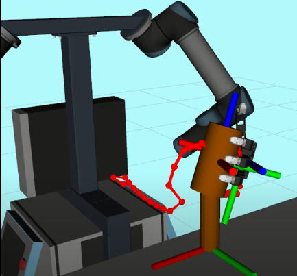

# Motion Planning with Constraints

This *metarepo* has been prepared to illustrate the work done within workpackage 5.2 of the [SMARTHANDLE](https://smarthandle-project.eu/) project regarding the motion planning for a robot arm considering task constraints.

It contains two repositories:

- The [kautham](https://sir.upc.edu/projects/kautham_tutorials/basic/overview/overview.html) motion planning framework,
- The **kautham_ros** wrapping package to integrate **kautham** within ROS 2.

This README provides a generic overview for defining and using constraints in Kautham problem files. It covers the required XML structure, constraint specification, and workflow for planning and visualization using the Kautham GUI.

A detailed description of this contribution is described in the paper [Motion planning with constraints for a safe human-robot interaction](docs/constraint_motion_planning_paper.pdf) by P. Ramon-Canyameres, I. Zaplana and J. Rosell, accepted to the 2025 Workshop on Empowering Industry 5.0: Adaptive Planning, Learning, and Control in Human-Robot Collaboration within the 30th IEEE International Conference on Emerging Technologies and Factory Automation.

## 1. Problem File Structure Overview

Your Kautham XML problem file should include the following main sections:

- **Robot Section:**  
  Specifies the robot model (URDF), home configuration, workspace limits, and any associated constraints.

- **Obstacles Section:**  
  Lists all static obstacles in the environment, including their URDF files and poses.

- **Initial Attachments:**  
  Defines obstacles initially attached to the robot (e.g., objects held by a manipulator).

- **Controls:**  
  Points to the robot control configuration file used for planning.

- **Planner Section:**  
  Contains planner parameters and a set of queries specifying the initial and goal joint values for the robot.


## 2. Defining Constraints

Constraints are critical for specifying task requirements, such as maintaining a certain orientation, position, or workspace region for a robot link. Constraints are defined within the `<Robot>` section of the XML file.

### Constraint Block Structure

Each constraint is defined as a `<Constraint>` element with the following general structure:

```
<Constraint id="unique_constraint_id" type="constraint_type">
    <Enabled status="true"/>
    <TargetLink name="target_link_name"/>
    <!-- Additional elements depend on the constraint type -->
    <Joint name="joint_name_1" />
    <Joint name="joint_name_2" />
    <!-- ... -->
</Constraint>
```

| Element                | Description                                 | Example Value                          |
|------------------------|---------------------------------------------|----------------------------------------|
| `<Constraint id type>` | Unique identifier and constraint type       | `id="ori_arm" type="arm_orientation"`  |
| `<Enabled status>`     | Enable or disable the constraint            | `status="true"`                        |
| `<TargetLink name>`    | Robot link to which the constraint applies  | `name="end_effector_link"`             |
| `<Joint name>`         | Joints affected by the constraint, following the kinematic chain order           | `name="joint1"` (repeat as needed)     |


### Type-Specific Elements:
Depending on the constraint type, include additional elements such as:

- Orientation Constraint:
```
<FreeMovementAxes x="false" y="true" z="false"/>
<TargetOrientation qx="..." qy="..." qz="..." qw="..."/>
<Tolerance value="0.1" variable="false" gradient="0.0"/>
```

- Geometric Constraint:
```
<AllowedVolumeRegion name="Inner"/>
<GeometricParams radius="0.5" height="1.3"/>
<ReferenceFrame entity="reference_object" link="base"/>
<Origin xyz="..." rpy="..."/>
```

## 3. Using Constraints in the Kautham GUI

1. Set Up Paths:
In the Kautham GUI, edit the "Default Path" to specify where your robot and obstacle models are located.

2. Load the XML Problem:
Open your XML problem file in the GUI.

3. Configure the Planner:
Go to the "OMPL Constr Planner" tab and adjust planner parameters as needed.

4. Plan the Path:
Click the "Get Path" button to compute the robot’s motion plan.

5. Visualize the Path:
Use the "Start Move" button to visualize the planned motion.

## 4. Using Constraints with the Kautham_ros interface



## 4. Tips for Defining Constraints

- Reference correct links and joints as defined in your robot's URDF.

- Adjust tolerance and geometric parameters to match your task requirements.

- Ensure all referenced files (URDFs, control files, etc.) are accessible from the specified paths.

- Consult Kautham documentation for supported constraint types and detailed parameter descriptions.
